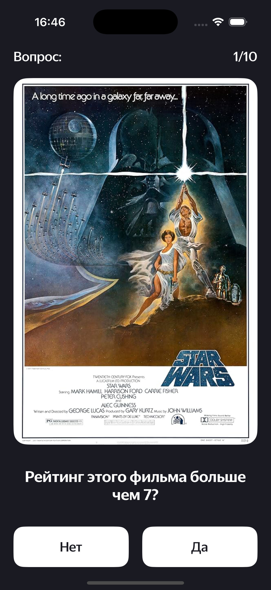
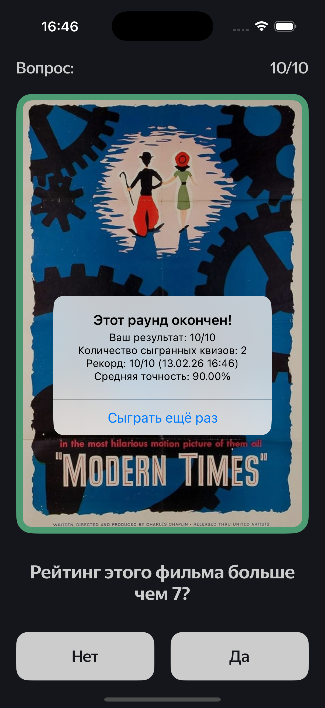

# 🎯 MovieQuiz
MovieQuiz is an iOS quiz application built with UIKit and Storyboard. It challenges users with 10 questions per round, asking whether a movie’s IMDb rating is above 7. At the end of the round, users can see their statistics and play again. The app fetches movie posters and ratings using the IMDb API.

## ✨ Features
- 🎬 Quiz questions based on IMDb Top-250 and popular movies
- 🧮 10 questions per round
- 📊 Round statistics with score and feedback
- 🔄 Option to play again after each round
- 🖼 Movie posters loaded from IMDb API
- 🧪 Unit and UI tests included
- 🎨 Figma design mockup available

## 🛠 Tech Stack
**Language:** Swift 
**UI:** UIKit + Storyboard 
**Networking:** REST API (IMDb) 
**Testing:** Unit Tests, UI Tests 
**Design:** Figma 

## 📸 Screenshots

  
  

## 🎨 Design
The UI/UX design was created in Figma:
👉 [Open Figma Prototype](https://www.figma.com/file/l0IMG3Eys35fUrbvArtwsR/YP-Quiz?node-id=34%3A243)

## 🚀 Installation
1. Clone the repository
2. Open the project in Xcode
3. Run the project on a simulator or device (iOS 15+)

## 📫 Contact
E-mail: alnepryakhin@gmail.com 
Telegram: https://t.me/nizyashka 
GitHub: https://github.com/nizyashka 
